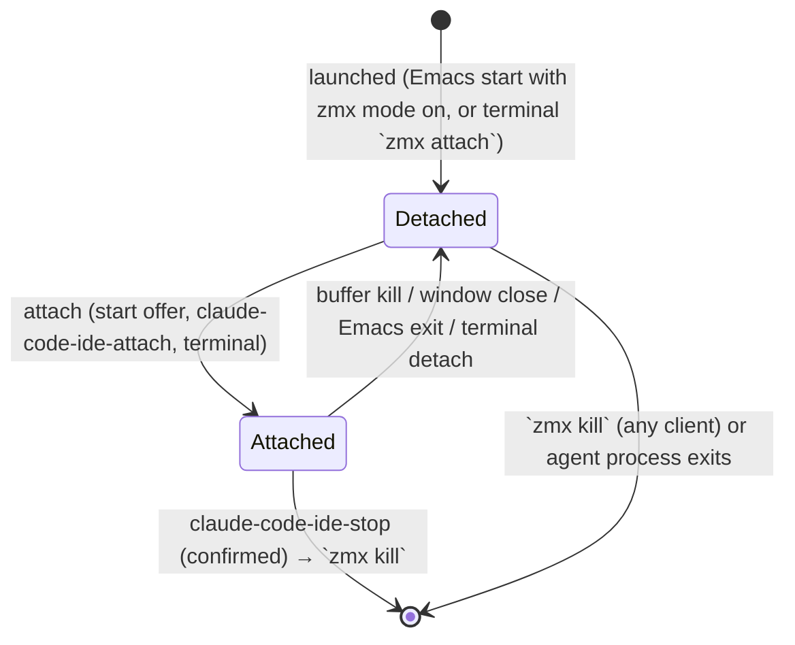

# Data Model: zmx-backed persistent agent sessions

Phase 1 output. Terms follow `CONTEXT.md`. No persistent Emacs-side storage:
zmx is the source of truth for zmx sessions.

## Session (existing struct, extended)

`claude-code-ide-session` (cl-defstruct, claude-code-ide.el:409), stored in the
`claude-code-ide--sessions` hash keyed by `id`.

| Field | Type | Change | Notes |
|---|---|---|---|
| `id` | string | unchanged | Emacs-side session-id; fresh on every attach/adopt |
| `directory` | string | unchanged | project working directory |
| `process` | process | unchanged | with zmx mode: the local `zmx attach` client |
| `buffer` | buffer | unchanged | terminal buffer |
| `cli-session-id`, `order`, `created-at`, `last-accessed-at`, `custom-name`, `title` | — | unchanged | |
| `zmx-name` | string or nil | **NEW** | nil = plain session (zmx mode off); non-nil links the Session to a Zmx session |

Validation rules:
- `zmx-name` is set once at creation/adoption and never mutated.
- At most one Session per `zmx-name` per Emacs instance for the start-time
  offer (FR-006 exclusion); `claude-code-ide-attach` may deliberately create
  another (multi-attach allowed).

## Zmx session (external, read-only projection)

Parsed from `zmx list` rows into a plist. Never cached; queried on demand.

| Key | Type | Source | Used for |
|---|---|---|---|
| `:name` | string | zmx | identity, offer/adopt candidate |
| `:start_dir` | string | zmx | adopted Session `directory` (FR-008) |
| `:cmd` | string | zmx | CLI-type inference, annotations (FR-007/008) |
| `:pid`, `:clients`, `:created` | string | zmx | annotations only; optional |

Tolerance rule: absent keys are nil; a row with no `:name` is dropped
(research R2).

## Zmx session name (value format)

```
<prefix><agent>-<project>-<id-short>
```

- `prefix`: `claude-code-ide-zmx-session-prefix`, default `cci-`.
- `agent`: CLI type symbol name (`claude`, `codex`, `opencode`, `pi`, `omp`).
- `project`: sanitized directory basename — lowercased, every non-alphanumeric
  run collapsed to one `-`, leading/trailing `-` trimmed.
- `id-short`: the random `make-temp-name` suffix of the Emacs session-id.

The reattach-offer match key (FR-006) is the constant left part:
`<prefix><agent>-<project>-`.

## State transitions



The Emacs-side Session lifecycle is unchanged: it is created on attach/adopt
and removed by the existing cleanup path when its buffer or client process
dies. Removing a Session never removes the Zmx session (detach-by-default).
