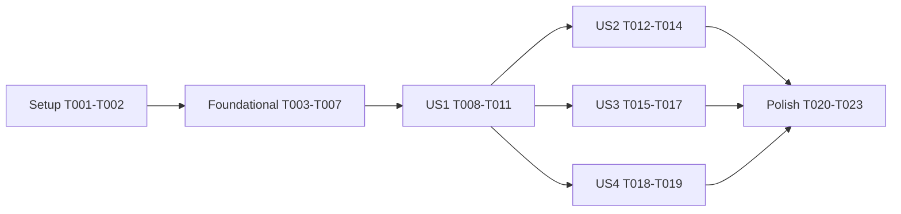

# Tasks: zmx-backed persistent agent sessions

**Input**: Design documents from `/specs/001-zmx-sessions/`

**Prerequisites**: plan.md, spec.md, research.md, data-model.md, contracts/commands.md, quickstart.md

**Tests**: Included. The constitution (Principle II) requires ERT tests for new logic, batch-safe with zmx mocked.

**Organization**: Tasks are grouped by user story from spec.md. Most tasks edit the same three files (`claude-code-ide-zmx.el`, `claude-code-ide.el`, `claude-code-ide-tests.el`), so parallelism inside a story is limited by design.

## Phase 1: Setup

- [ ] T001 Create `claude-code-ide-zmx.el` skeleton: `lexical-binding: t`, GPL-3+ header block, Commentary, `(provide 'claude-code-ide-zmx)`, and the three defcustoms from contracts/commands.md (`claude-code-ide-use-zmx` nil, `claude-code-ide-zmx-program` "zmx", `claude-code-ide-zmx-session-prefix` "cci-")
- [ ] T002 Add `(require 'claude-code-ide-zmx)` to `claude-code-ide.el` beside the existing internal requires (around line 72), and confirm `./scripts/compile-and-test.sh` still byte-compiles both files cleanly

## Phase 2: Foundational (blocking prerequisites for all user stories)

- [ ] T003 Implement subprocess choke point in `claude-code-ide-zmx.el`: `claude-code-ide-zmx--ensure` (`executable-find` on `claude-code-ide-zmx-program`, else `user-error` naming zmx, FR-009) and `claude-code-ide-zmx--call` (run zmx with args via `call-process`, return trimmed stdout, signal on nonzero exit) per research R8
- [ ] T004 Implement `zmx list` support in `claude-code-ide-zmx.el`: `claude-code-ide-zmx--parse-list-line` (tab-separated key=value → plist, drop rows without `:name`) and `claude-code-ide-zmx-list-sessions` (call `zmx list`, fall back to `--short` bare names) per research R2
- [ ] T005 Implement name scheme in `claude-code-ide-zmx.el`: `claude-code-ide-zmx--sanitize` (lowercase, collapse non-alphanumerics to `-`, trim) and `claude-code-ide-zmx-session-name` building `<prefix><agent>-<project>-<id-short>` from cli-type, directory, and the `make-temp-name` suffix of the session-id, plus `claude-code-ide-zmx--offer-prefix` returning the `<prefix><agent>-<project>-` match key, per research R6 and data-model.md
- [ ] T006 Add `zmx-name` slot (default nil) to the `claude-code-ide-session` struct in `claude-code-ide.el` (line 409) per data-model.md
- [ ] T007 [P] Add foundational ERT tests in `claude-code-ide-tests.el`: list-line parsing (key=value row, `--short` bare name, nameless row dropped, missing fields nil), sanitizer and name format, offer-prefix value, and `claude-code-ide-zmx--ensure` signaling `user-error` when `executable-find` is nil (use `cl-letf` mocks; no zmx binary)

**Checkpoint**: adapter is pure plumbing, fully tested, nothing user-visible changed.

## Phase 3: User Story 1 - Agent survives Emacs (Priority: P1) 🎯 MVP

**Goal**: with `claude-code-ide-use-zmx` non-nil, agents run inside zmx sessions and survive buffer kills and Emacs exit; nil preserves today's behavior exactly.

**Independent Test**: quickstart.md Scenario 1 plus the negative checks; ERT covers the wrap and the nil path.

- [ ] T008 [US1] Implement `claude-code-ide-zmx-wrap-command` in `claude-code-ide-zmx.el`: given name and shell command string, return `(combine-and-quote-strings (append (list program "attach" name) (split-string-and-unquote cmd)))`; nil cmd → attach-only form, per research R3
- [ ] T009 [US1] Wire the wrap at the shared seam in `claude-code-ide.el`: in `claude-code-ide--create-session` (line 1706) derive the zmx name via `claude-code-ide-zmx-session-name`, store it in the session's `zmx-name` slot, and in `claude-code-ide--create-terminal-with-command` (line 1525) replace `cmd` with the wrapped command when `claude-code-ide-use-zmx` is non-nil (call `claude-code-ide-zmx--ensure` first); no per-agent builder changes (FR-001, FR-002, FR-003)
- [ ] T010 [US1] Verify detach-by-default paths in `claude-code-ide.el` need no change: buffer kill hook, process sentinel, and `kill-emacs-hook` cleanup (lines 1111-1119, 1752-1758) must not prompt and must not call `zmx kill`; adjust only if a path kills more than the local attach client (FR-004, research R5)
- [ ] T011 [US1] Add US1 ERT tests in `claude-code-ide-tests.el`: with `claude-code-ide-use-zmx` nil the terminal command is byte-identical to today; non-nil wraps as `zmx attach <name> <argv...>` for each CLI type (claude/codex/opencode/pi/omp) through the shared seam; wrap preserves flags like `-c`; session struct carries `zmx-name`; missing zmx signals `user-error` at start

**Checkpoint**: MVP. Start under zmx, kill buffer, reattach from a terminal.

## Phase 4: User Story 2 - Reattach after Emacs restart (Priority: P2)

**Goal**: plain session start offers orphaned matching zmx sessions via completing-read with "create new"; continue/resume always creates new.

**Independent Test**: quickstart.md Scenario 2; ERT drives the offer logic with mocked `zmx list` and `completing-read`.

- [ ] T012 [US2] Implement `claude-code-ide-zmx--eligible-sessions` in `claude-code-ide-zmx.el`: filter `claude-code-ide-zmx-list-sessions` by the offer prefix and subtract names already present as `zmx-name` in live sessions (exclusion per clarification 1); takes the live-name list as an argument to stay decoupled from `claude-code-ide--sessions`
- [ ] T013 [US2] Wire the offer into `claude-code-ide--create-session` in `claude-code-ide.el`: only when zmx mode is on and neither continue nor resume is set (clarification 2), offer eligible names plus "create new" via `completing-read`; selection attaches (wrap with nil cmd, fresh session-id, `zmx-name` = selected); no eligible match → create silently (FR-006)
- [ ] T014 [US2] Add US2 ERT tests in `claude-code-ide-tests.el`: eligible filtering (prefix match, live-name exclusion), no-match → no prompt, continue/resume → no prompt and new session, selection → attach command without agent argv and fresh session-id, "create new" → normal creation

**Checkpoint**: Emacs restart round trip works end to end.

## Phase 5: User Story 3 - Adopt a terminal-launched session (Priority: P3)

**Goal**: `claude-code-ide-attach` adopts any zmx session into a full Session with inferred CLI type and directory.

**Independent Test**: quickstart.md Scenario 3; ERT drives adoption with mocked `zmx list`.

- [ ] T015 [US3] Implement `claude-code-ide-zmx-infer-cli-type` in `claude-code-ide-zmx.el`: file-name base of the head word of a `cmd` string matched against `claude-code-ide-agent-definitions` values plus `claude-code-ide-cli-path`; return the cli-type symbol or nil, per research R7
- [ ] T016 [US3] Implement `claude-code-ide-attach` command in `claude-code-ide.el`: `completing-read` over all `zmx list` rows annotated with `start_dir` and `cmd`; infer CLI type (prompt via `claude-code-ide--read-agent` on nil); directory from `start_dir` (fall back to prompting for a directory when absent); then reuse the session-creation path with an attach-only wrapped command, fresh session-id, and `zmx-name` set (FR-007, FR-008); empty list → message; add autoload cookie
- [ ] T017 [US3] Add US3 ERT tests in `claude-code-ide-tests.el`: inference for each agent binary and for path-qualified heads (`/usr/local/bin/omp`), nil on unknown command, adoption creates a Session with directory from `start_dir` and inferred cli-type, unknown command triggers the agent prompt path

**Checkpoint**: terminal → Emacs adoption round trip works (SC-004).

## Phase 6: User Story 4 - Explicit stop kills the zmx session (Priority: P4)

**Goal**: `claude-code-ide-stop` on a zmx-backed session prompts, then runs `zmx kill`.

**Independent Test**: quickstart.md Scenario 4; ERT verifies prompt gating with mocked `yes-or-no-p`.

- [ ] T018 [US4] Implement `claude-code-ide-zmx-kill` in `claude-code-ide-zmx.el` (thin `claude-code-ide-zmx--call "kill" name`) and branch `claude-code-ide-stop` in `claude-code-ide.el` (line 1866): session with non-nil `zmx-name` → `yes-or-no-p` naming the zmx session; confirm → `zmx kill` then existing cleanup; decline → no action; nil `zmx-name` → unchanged path (FR-005)
- [ ] T019 [US4] Add US4 ERT tests in `claude-code-ide-tests.el`: confirm → kill called with the right name and cleanup runs; decline → no kill, session intact; non-zmx session → kill never called

**Checkpoint**: all four stories complete and independently verified.

## Phase 7: Polish & Cross-Cutting Concerns

- [ ] T020 [P] Update `AGENTS.md` core files list: add `claude-code-ide-zmx.el` with a one-line description
- [ ] T021 [P] Document zmx mode in `README.md`: enabling, naming scheme, detach/reattach and adoption workflows, the stale-environment limitation from ADR 0001
- [ ] T022 Run `./scripts/compile-and-test.sh` and fix any byte-compile warnings or test failures (SC-002, SC-003)
- [ ] T023 Run quickstart.md Scenarios 1-4 and the negative checks interactively with a real zmx binary; record results in the PR/summary (SC-001, SC-004, SC-005)

## Dependencies

- US1 blocks US2/US3/US4 (they reuse the wrap, `zmx-name` slot, and attach path).
- US2, US3, and US4 are mutually independent once US1 lands, but they all edit `claude-code-ide.el` and `claude-code-ide-tests.el`: sequence them, or coordinate ownership if parallel agents run them.

## Parallel Execution Examples

- After T006: T007 (tests) in parallel with starting T008 (different concern, same milestone).
- After US1: US2 (T012-T014), US3 (T015-T017), US4 (T018-T019) may run as parallel agents only with same-file coordination on `claude-code-ide.el`/`claude-code-ide-tests.el`; otherwise run in priority order.
- Polish: T020 and T021 in parallel; T022 then T023 strictly last.

## Implementation Strategy

MVP is Phase 1 + Phase 2 + User Story 1 (T001-T011): agents survive Emacs and are reattachable from a terminal. Each later story is an independently shippable increment; stop after any checkpoint and still deliver value. Skip formatters and the full suite between tasks; T022 is the single verification gate, T023 the interactive proof.
