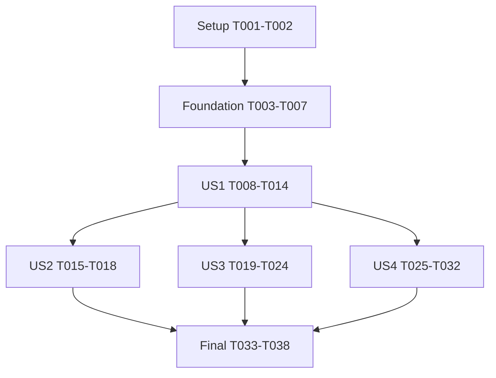

# Tasks: Grouped Global View

**Input**: Design documents in `specs/004-grouped-global-view/`.
**Prerequisites**: [plan.md](plan.md), [spec.md](spec.md), [research.md](research.md), [data-model.md](data-model.md), and [contracts](contracts/manager-view.md).
**Additional contract**: [remote-metadata.md](contracts/remote-metadata.md).
**Validation guide**: [quickstart.md](quickstart.md).
**Branch**: Work on the existing `main` checkout. Do not create a worktree or commit without a user request.
**Scope**: Implement all four accepted P1 stories. US1 is the first reviewable increment, not the complete feature.
**Runtime**: Emacs Lisp with lexical binding, Emacs 28.1+, and existing package dependencies. No new runtime module or dependency.

**Tests**: Constitution II requires ERT for new logic. The approved plan specifies behavioral regressions and live acceptance checks.
Extend `claude-code-ide-tests.el` and its existing mocks. Do not add a separate test framework or tests of source text and forwarding alone.

## Format and execution rules

Each task has a sequential ID, an optional `[P]` marker, and a story label within story phases.
Paths are repository-relative. Read the named design section before implementing its task.
A `[P]` marker permits concurrency only after the dependencies below are complete and the file owner is free.
Never run concurrent edits to the same file. One integration owner controls `claude-code-ide-manager.el` and `claude-code-ide-tests.el`.

Write the listed regressions before the corresponding behavior changes. Confirm the relevant failure before fixing it in a serial validation window.
Concurrent workers must skip builds, tests, formatters, and linters. Run targeted checks after their edits settle.
Run the full project verification once at the final integration gate.

## Phase 1: Setup

**Purpose**: Establish the implementation reference map and isolated test support without adding runtime dependencies.

- [X] T001 Resolve references for the changed Session struct, manager ordering/state functions, and remote runner in `claude-code-ide.el`, `claude-code-ide-manager.el`, and `claude-code-ide-zmx.el`. Use LSP references where available. Compare the callers with research R2 and preserve unrelated working changes.
- [X] T002 Extend existing isolated manager fixtures in `claude-code-ide-tests.el` for metadata-bearing Sessions, remembered rows, and scope-view snapshots. Keep persistence data and terminal processes test-owned. Reuse current reset and dependency mocks instead of adding another fixture framework.

**Checkpoint**: Reference changes are understood and fixtures cannot touch user state.

## Phase 2: Foundational

**Purpose**: Add the shared metadata and persistence model used by every story.
All story implementation depends on this phase. Remote transport remains in US4, not in the foundation.

- [X] T003 Add state-model regressions in `claude-code-ide-tests.el` for versions 1–3 migrating to version 4 without losing identities, selection, pins, order, or layouts. Check flat defaults, persistence-disabled behavior, invalid-cache rejection without row loss, and restoration without SSH.
- [X] T004 Add the `group-metadata` plist slot to the existing structs in `claude-code-ide.el` and `claude-code-ide-manager.el`. Use the exact fields and required combinations from `data-model.md`. Do not add a new Session scope or durable group registry.
- [X] T005 Implement shared metadata validation and derived group-key helpers in `claude-code-ide-manager.el`. Separate Git, non-Git, and unresolved kinds. Keep remote paths opaque. Preserve exact unresolved `(host, directory)` identity, including trailing separators, with Session-ID singletons when directories are missing.
- [X] T006 [P] Extend global scope state, serialization, restoration, reset values, and version acceptance in `claude-code-ide-manager.el` for schema 4, `:view`, and validated metadata. Preserve legacy state and matching caches through `--make-item` and remembered-row rebuilds. Save view/cache changes before reload-capable refresh.
- [X] T007 [P] Preserve matching metadata through `--materialize-remote-target`, `--create-remote-session`, and Session registration in `claude-code-ide.el`. Match exact host and directory before copying a cache. A reattach attempt must not erase the remembered cache before a replacement Session exists.

**Checkpoint**: State restoration and reattach materialization preserve existing behavior without issuing metadata requests.

## Phase 3: User Story 1 - Switch between flat and grouped views (Priority: P1)

**Goal**: Present the same global Sessions as a flat list or host/project groups without changing selection or layouts.

**Independent Test**: Use local main/linked Worktrees and an independent clone with multiple Sessions in one Worktree.
Toggle both ways and restore persisted state. Every Session must remain independently selectable under the correct heading.
Cached remote records can exercise Host sections before US4 adds live metadata requests.

### Tests

- [X] T008 [US1] Add real Git identity and local metadata regressions in `claude-code-ide-tests.el`. Cover linked and bare-linked Worktrees, separate Git directories, symlinks, independent clones, unborn branches, detached HEAD, and non-Git directories. Check permission failures and malformed repositories. Verify errors preserve a matching cache instead of falsely classifying non-Git.
- [X] T009 [US1] Add grouped presentation and toggle regressions in `claude-code-ide-tests.el`. Cover duplicate headings, same-Worktree Sessions, branch/custom-name collisions, global slots beyond ten rows, and unchanged repo-local presentation. Check active/selected identity preservation without acknowledgment. Check cached row rendering, including help text, starts no processes.

### Implementation

- [X] T010 [P] [US1] Implement local metadata refresh in `claude-code-ide-manager.el` once per unique directory. Use canonical Git common-directory identity and cached branch/worktree labels. Preserve exit status and stderr, force C locale, and clear repository-location overrides. Apply the plan's non-Git/error distinction and last-good-cache rule.
- [X] T011 [US1] Extend `--sorted-items` and every consumer listed in research R2 in `claude-code-ide-manager.el` with explicit scope/view context. Produce one ordered Session sequence for rendering, slots, visible keys, movement, and editor paths. Derive grouped labels without overwriting flat labels. Sort hosts/groups before within-group pin/manual/fallback precedence. Reverse only the Session fallback order.
- [X] T012 [US1] Implement grouped heading insertion and `claude-code-ide-manager-toggle-grouped-view` in `claude-code-ide-manager.el`. Add sidebar `v`, cache-backed help text, and non-interactive headings without Session or Avy properties. Save the global view before refresh and preserve selected/active IDs. Update visible global frames and leave hidden/repo-local sidebars unchanged.
- [X] T013 [P] [US1] Add manager-menu `v` with its current-view description in `claude-code-ide-transient.el`. Call the fixed toggle command from `contracts/manager-view.md`. Preserve the main package transient's existing bindings and do not issue SSH from the toggle.
- [X] T014 [US1] Exercise US1 through the actual manager using `specs/004-grouped-global-view/quickstart.md` sections 2–4. Use only the local fixture, presentation, toggle, and persistence checks at this checkpoint. Record identity, labels, shortcuts, toggle, persistence, and visual results there. Use `emacsclient` for compatible reloads and a fresh test instance for changed struct layouts.

**Checkpoint**: US1 works with local repositories and cached/unresolved remote rows. Remote metadata acquisition remains US4 work.

## Phase 4: User Story 2 - Navigate between project groups (Priority: P1)

**Goal**: Jump between groups while preserving the manager's selected-versus-active distinction.

**Independent Test**: Navigate local and cached remote groups with connected and remembered disconnected first rows.
Verify wrapping, sidebar focus, unchanged terminal on disconnected targets, and the next jump's origin.

### Tests

- [X] T015 [US2] Add group-navigation regressions in `claude-code-ide-tests.el`. Cover point → selected → active origin precedence, heading positions, host-boundary wrapping, zero/one group, and wrong-view errors. Check ordinary row navigation skips headings. Check disconnected jumps persist selection without SSH, acknowledgment, or terminal replacement.

### Implementation

- [X] T016 [P] [US2] Implement `claude-code-ide-manager-next-project-group` and `claude-code-ide-manager-previous-project-group` in `claude-code-ide-manager.el`. Bind sidebar `C-j` and `C-k`. Use the shared displayed sequence and existing switch path. Continue from selected disconnected rows, show explicit reattach guidance, and preserve sidebar focus.
- [X] T017 [P] [US2] Add `C-j` and `C-k` entries to the manager dispatch in `claude-code-ide-transient.el`. Use the command names fixed in `contracts/manager-view.md`. Preserve ordinary `n`/`p`, numeric shortcuts, `G`, and main-menu bindings.
- [X] T018 [US2] Exercise US2 with actual keyboard input using the navigation checks in `specs/004-grouped-global-view/quickstart.md` sections 3 and 5. Use existing cached/remembered rows without the US4 metadata command. Record wrapping, focus, disconnected-target behavior, and Spacemacs/Evil binding results. Confirm the displayed terminal stays unchanged when the selected target is disconnected.

**Checkpoint**: Group navigation works independently of US3 ordering and US4 metadata transport.

## Phase 5: User Story 3 - Order sessions in grouped view (Priority: P1)

**Goal**: Support pins, sidebar moves, and grouped `E` without crossing group boundaries or losing Session identity.

**Independent Test**: Use groups whose flat directory-name order differs from grouped branch-name order.
Move adjacent rows, edit grouped order, and apply with remembered disconnected rows. Verify occupied flat positions and atomic rejection of invalid edits.

### Tests

- [X] T019 [US3] Add grouped-order regressions in `claude-code-ide-tests.el` for opposite flat/grouped fallback orders, three-row groups, and existing pin buckets. Check requested adjacent moves, other groups' displayed order, and occupied flat positions. Cover grouped `E` materialization while keeping flat-view swap behavior unchanged.
- [X] T020 [US3] Add grouped editor regressions in `claude-code-ide-tests.el` for fixed headings, kill/yank identity, duplicate/foreign/missing rows, disconnected membership, cancellation, resync, and post-open Sessions. Reject changed opening row text or current group membership before mutation. A metadata-only branch change may remain valid if group identity and buffer opening labels are unchanged.

### Implementation

- [X] T021 [P] [US3] Implement the occupied-position merge for grouped sidebar movement in `claude-code-ide-manager.el`. Swap adjacent displayed rows before assigning keys. Merge all group sequences into baseline flat positions without clearing pins. Keep same-group/same-pin restrictions and the existing flat-view swap. Never blindly swap keys materialized from flat fallback order.
- [X] T022 [US3] Extend grouped `E` snapshots, rendering, movement, and renumbering in `claude-code-ide-manager.el`. Capture editor view, group keys, fixed headings, opening labels, Session IDs, and baseline flat order. Distinguish headings from Session rows and preserve existing blank-line and hidden-identity behavior.
- [X] T023 [US3] Extend grouped `E` validation, apply, and sort resync in `claude-code-ide-manager.el`. Validate current scope-item presence rather than liveness, and validate opening labels separately from group identity. Apply the occupied-position merge only after every check passes, then clear scope pins. Preserve new-Session fallback, captured-view resync, cancellation, and flat-editor behavior. Do not auto-resync a dirty editor after metadata completion or a sidebar toggle.
- [X] T024 [US3] Exercise US3 through the real editor using `specs/004-grouped-global-view/quickstart.md` section 4. Record visible moves, fixed headings, disconnected-row apply, cancellation, and stale-membership rejection. Verify invalid apply leaves both pins and order unchanged.

**Checkpoint**: Grouped `E` works with cached metadata and remembered rows without requiring a live remote metadata request.

## Phase 6: User Story 4 - Group remote sessions without network work during redraw (Priority: P1)

**Goal**: Obtain safe remote Git metadata after attachment or for all known Sessions on one explicitly chosen host.

**Independent Test**: Attach existing approved remote Sessions and invoke dedicated refresh for one host.
Include remembered Sessions and a second host. Verify correct grouping, host isolation, cache retention, and zero discovery or reattach.
Controlled transport tests prove failures and races without modifying real remote state.

### Tests

- [X] T025 [US4] Add transport and protocol regressions in `claude-code-ide-tests.el` for the exact `contracts/remote-metadata.md` framing. Cover field combinations, index/count validation, unsafe input, query classification, and size/deadline limits. Preserve existing zmx attach/Stop validation. Use real local Git cases and controlled SSH outcomes, not live failures.
- [X] T026 [US4] Add metadata lifecycle regressions in `claude-code-ide-tests.el` for chosen-host snapshots, remembered rows, batching, cache persistence, and cancellation. Check stale ownership after detach, reattach, Stop, and host removal. Check non-signaling startup failure preserves terminals and attach counts. Assert `/a/b` and `/a/b/` remain separate unresolved identities. Reset the transient host table and cancel only test-owned requests.

### Implementation

- [X] T027 [P] [US4] Extract the private owned SSH-process runner within `claude-code-ide-zmx.el` while retaining `--call-remote` as the zmx adapter. Preserve configured-host checks, zmx name validation, strict SSH options, stdout/stderr separation, thirty-second deadlines, no retries, and once-only callback cleanup. Do not expose arbitrary remote shell commands publicly.
- [X] T028 [US4] Implement the Git metadata adapter, fixed probe, and parser in `claude-code-ide-zmx.el` for one bounded batch per request. Enforce directory-count, encoded-command, stdout, and deadline limits from `contracts/remote-metadata.md`. Quote directories as data, clear `CDPATH` and repository overrides, and resolve paths on the owning host. Validate NUL framing before returning records. Document the private adapter signature, command-size calculation, and outcome shape in `specs/004-grouped-global-view/contracts/remote-metadata.md` for T029. Do not own a pending queue, operation token, or cross-request deduplication.
- [X] T029 [US4] Implement `claude-code-ide-manager-refresh-remote-metadata` and transient host-operation ownership in `claude-code-ide-manager.el` against the completed T028 interface. Prompt for one configured host and snapshot all its known live/remembered targets. Own the finite pending queue, operation token, exact-directory deduplication, batch partitioning, and sequential dispatch exclusively in the manager. Use T028's command-size calculation when partitioning batches. Do not discover or reattach Sessions. Check operation tokens, exact target identities, live owners, and Stop ownership before publishing. Save accepted cache updates before refresh and preserve caches on query failures.
- [X] T030 [US4] Add the optional post-attach enqueue hook in `claude-code-ide.el` at the end of `--create-remote-session`, after normal display/logging. Give enqueue its own non-signaling error handler. Return the registered Session normally on validation or SSH-start failure, preserving reattach selection and bulk-attach counts. Queue replacement owners with fresh snapshots.
- [X] T031 [P] [US4] Add manager-menu `m` for `claude-code-ide-manager-refresh-remote-metadata` in `claude-code-ide-transient.el`. Keep `G` network-free and retain all existing attach, reattach, Stop, navigation, and main-menu bindings.
- [X] T032 [US4] Exercise US4 using `specs/004-grouped-global-view/quickstart.md` section 5 and record the approved host scope and results. Verify linked Worktree grouping and remembered-row refresh on that host only. Confirm ordinary `G`, startup, restoration, redraw, toggle, and navigation produce no metadata requests.

**Checkpoint**: US4 adds metadata acquisition to the shared view/cache model. Metadata failure cannot undo attachment or restore a removed Session.
The final phase waits for the independent checks from all four stories.

## Phase 7: Polish and cross-cutting validation

**Purpose**: Complete documentation and integrated acceptance after story smoke checks prove the behavior.

- [X] T033 [P] Update `README.org` with the global view switch, shortcuts, grouped `E`, and dedicated host refresh. Document exact unresolved identity, separate-Git-directory heading names, and shared-key materialization effects. Keep headings non-interactive and project-wide actions outside scope.
- [X] T034 [P] Update `specs/003-attach-remote-agents/contracts/remote-sessions.md` and `specs/003-attach-remote-agents/contracts/zmx-attach-guard.md` to describe grouped host presentation and optional read-only metadata requests. Preserve stock zmx discovery, guarded attachment, network-free ordinary refresh, and verified Stop safety.
- [X] T035 Format only affected Elisp using the supported scope of `scripts/format-and-clean.sh`, then run `scripts/compile-and-test.sh` once after all code edits settle. Preserve unrelated changes. Record actual byte-compilation and full ERT results in `specs/004-grouped-global-view/quickstart.md`.
- [X] T036 Complete the integrated UI/Ghostel/persistence acceptance matrix in `specs/004-grouped-global-view/quickstart.md`. Use compatible `emacsclient` reloads or a fresh test instance for changed structs. Verify local and remote Ghostel behavior, explicit missing-support errors, real keyboard behavior, view restoration, and request-free ordinary interactions.
- [X] T037 Measure cached preparation as specified in `specs/004-grouped-global-view/quickstart.md`: 1,000 Sessions, 100 groups, and 20 runs. Record the median and runtime details. Include cached help text and assert zero process starts. Measure local metadata refresh separately and correct avoidable repeated work if the target fails.
- [X] T038 Remove only implementation-owned temporary fixtures and throwaway scripts after preserving evidence in `specs/004-grouped-global-view/quickstart.md`. Link and complete the matching `TODOs.org` entry only after all accepted criteria pass. Do not commit or remove unrelated user work.

**Checkpoint**: Full feature acceptance is recorded. No deferred story, fake result, or unimplemented contract remains.

## Dependencies and execution order

### Story completion graph

All stories retain the specification's P1 priority. Their order reflects shared prerequisites, not a lower release priority.
US2 and US3 use the US1 view/order interface. US4 uses the same metadata presentation and cache model.
US2, US3, and US4 do not depend on one another for their isolated behavior checks.
Their shared manager/test files still require serialized ownership.

### Task dependency table

A range means every task in that inclusive range. These are prerequisites, not permission for same-file concurrency.

| Task | Prerequisites |
|---|---|
| T001 | None |
| T002 | T001 |
| T003 | T002 |
| T004 | T003 |
| T005 | T004 |
| T006, T007 | T005 |
| T008 | T006–T007 |
| T009 | T008 |
| T010, T013 | T009 |
| T011 | T010 |
| T012 | T011 |
| T014 | T012–T013 |
| T015 | T014 |
| T016, T017 | T015 |
| T018 | T016–T017 |
| T019 | T014 |
| T020 | T019 |
| T021 | T020 |
| T022 | T021 |
| T023 | T022 |
| T024 | T023 |
| T025 | T014 |
| T026 | T025 |
| T027, T031 | T026 |
| T028 | T027 |
| T029 | T028 |
| T030 | T028–T029 |
| T032 | T028–T031 |
| T033, T034 | T018, T024, T032 |
| T035 | T033–T034 |
| T036 | T035 |
| T037 | T036 |
| T038 | T037 |

### Fixed interfaces for concurrent work

Use the metadata plist and state migration in [data-model.md](data-model.md) without changing their field names per worker.
Use command names and key scopes from [manager-view.md](contracts/manager-view.md).
The metadata adapter returns the existing transport outcome plus fully validated indexed records as defined in [remote-metadata.md](contracts/remote-metadata.md).
The manager exclusively owns target snapshots, finite pending queues, operation tokens, exact-directory deduplication, batch partitioning, sequential dispatch, and cache publication.
The zmx file owns one bounded batch request, command-size calculation, process transport, and probe/parser behavior.
T028 fixes and documents the private adapter signature and outcome shape before T029 consumes it.
The transport interface and its consumer therefore do not require concurrent workers to negotiate an unfinished contract.
This is one integration interface, not permission to create multiple implementations or expose arbitrary command execution.

### File ownership

- Serialize every task that edits `claude-code-ide-manager.el`.
- Serialize every task that edits `claude-code-ide-tests.el`, including tests from different stories.
- Serialize transient edits across US1, US2, and US4.
- T006 and T007 are independent only after T004–T005 settle their shared metadata contract.
- Menu tasks depend on fixed public contracts, not on the corresponding function body being finished.
- Complete all edits in a concurrent wave before any worker runs validation.

## Parallel execution examples

These examples describe future implementation work. Task generation does not execute them.

### US1

After T009, run T010 in `claude-code-ide-manager.el` alongside T013 in `claude-code-ide-transient.el`.
The menu worker uses the fixed toggle name and key contract. T011 and T012 remain serial manager work.

### US2

After T015, run T016 in `claude-code-ide-manager.el` alongside T017 in `claude-code-ide-transient.el`.
Validate keyboard behavior only after both finish.

### US3

All US3 implementation tasks touch the manager and therefore remain serial within the story.
After T020 and T026, run T021 alongside US4 T027, which owns `claude-code-ide-zmx.el`.
Do not run T021 alongside US4 T029 because both edit the manager.

### US4

After T026, run T027 and T031 in their separate source files.
T028 follows T027 on the zmx file and defines the adapter interface. T029 then implements manager orchestration.
T030 waits for both the adapter and manager orchestration.
Run T032 only after every US4 implementation task finishes.

### Shared and final work

After T005, T006 and T007 can run together in separate manager/core files.
After all story checks, T033 and T034 can update separate documentation files concurrently.
The final formatter, full suite, live checks, and benchmark run serially after edits settle.

## Requirement coverage

| Specification requirements | Tasks |
|---|---|
| FR-001–FR-006: view, persistence, identity, repo-local compatibility | T003–T007, T009, T011–T014 |
| FR-007–FR-010: row and repository identity, non-Git and populated Worktrees | T005, T008, T010–T012 |
| FR-011–FR-012: host/group presentation and ordering | T009, T011–T012 |
| FR-013: pin/manual order within groups | T019, T021 |
| FR-014–FR-015: grouped E and remembered rows | T020, T022–T024 |
| FR-016–FR-020: labels, fallback, heading disambiguation and hover | T008–T012 |
| FR-021: global displayed-order quick slots | T009, T011, T014 |
| FR-022–FR-026: group/row navigation and disconnected selection | T015–T018 |
| FR-027: post-attach and chosen-host metadata refresh | T025–T032 |
| FR-028: network-free ordinary interactions | T003, T009, T015, T026, T029–T032, T036 |
| FR-029: exact unresolved identity and resolution | T005, T026, T028–T029 |
| FR-030: fixed non-interactive headings and no empty groups | T009, T012, T020, T022 |
| FR-031–FR-034: remote safety, protocol and failure handling | T025–T030, T032 |
| FR-035: atomic stale grouped-editor rejection | T020, T023–T024 |

| Success criteria | Verification tasks |
|---|---|
| SC-001–SC-002: exact rows and repository/host identity | T008–T009, T014, T026, T032 |
| SC-003: adjacent group navigation | T015, T018 |
| SC-004: view-change identity and layouts | T003, T009, T014 |
| SC-005: within-group order boundaries | T019–T020, T024 |
| SC-006: displayed-order quick slots | T009, T014 |
| SC-007: network-free redraw, toggle, and navigation | T009, T015, T026, T032, T036 |
| SC-008: disconnected navigation | T015, T018 |
| SC-009: disconnected and stale grouped editor | T020, T024 |
| SC-010: safe dispatch and attachment-independent failures | T025–T026, T032 |
| SC-011: chosen-host-only known-target refresh | T026, T032 |

T035–T037 provide the final compile, ERT, UI, and performance gates.

## Implementation strategy

### First reviewable increment: US1

Complete Setup, Foundation, and US1, then validate its independent behavior.
This demonstrates the view switch and correct local/cached grouping without claiming that remote metadata acquisition is finished.
All four P1 stories remain required for the complete feature.

### Incremental delivery

1. Complete the shared model and state migration.
2. Complete US1 and verify the view/order interface.
3. Complete US2 and US3 against that stable interface.
4. Complete US4 with controlled failure/race checks and approved live remote validation.
5. Complete the final integrated gates and documentation.

Independent source ownership can overlap steps 3 and 4 as shown above.
Do not use a phase checkpoint as permission to omit later accepted stories.
No commit is part of this checklist unless the user separately requests it.

## Task totals

| Phase or story | Count |
|---|---:|
| Setup | 2 |
| Foundation | 5 |
| US1 | 7 |
| US2 | 4 |
| US3 | 6 |
| US4 | 8 |
| Final | 6 |
| Convergence | 4 |
| **Total** | **42** |

## Phase 8: Convergence

- [X] T039 Reject DEL (`U+007F`) and C1 (`U+0080`–`U+009F`) control characters in metadata request directories and decoded response fields in `claude-code-ide-zmx.el`. Extend `--valid-directory-p` and `--metadata-clean-p` without weakening shell quoting or changing zmx name policy. Add request-side and response-side regressions in `claude-code-ide-tests.el` that prove invalid directories never dispatch and invalid response fields reject the whole batch. Check the shared directory predicate's fail-closed effect on remembered-row restoration and reattach. Resolve F1 (HIGH) per FR-032, FR-033, SC-010, and T025/T028 (partial).
- [X] T040 Validate the canonical string form of Git response identity paths in `claude-code-ide-zmx.el` before `--metadata-validate-record` returns records. Reject syntactically noncanonical common-directory and project paths, including `/repo/../other/.git`, and apply the same check to nonempty canonical worktree paths. Use string checks only, never local filesystem or TRAMP resolution. Preserve exact requested-directory strings and the remote non-Git equality rule, including trailing separators. Add malformed-response regressions in `claude-code-ide-tests.el` that prove complete-batch rejection. Resolve F2 (MEDIUM) per plan: Remote request orchestration, T028, and `contracts/remote-metadata.md` response grammar and validation rules (partial).
- [X] T041 Include affected captured batch directories in whole-batch metadata failure reports from `claude-code-ide-manager--remote-metadata-callback` in `claude-code-ide-manager.el`. Report both host and target context for timeouts and other whole-batch failures while preserving caches, terminals, and existing request ownership. Verify a controlled failure exposes the affected target context without pinning exact message wording. Resolve F3 (LOW) per plan: Remote request orchestration, T029, and `contracts/remote-metadata.md` Failure and cancellation (partial).

## Phase 9: Convergence

- [X] T042 Correct host-heading placement in `claude-code-ide-manager--render-pin-order-editor` in `claude-code-ide-manager.el`. Emit each host heading before that host's first Project group, never between the previous group's heading and its Session rows. Add regressions in `claude-code-ide-tests.el` for local groups followed by a remote host and for two remote hosts, with multiple Session rows per group. Verify that an unedited grouped `E` buffer and valid within-group moves apply successfully, including remembered disconnected rows and scope pin clearing. Preserve rejection of cross-group edits and changed fixed headings without order or pin mutation. Resolve F1 (HIGH) per FR-014, FR-015, US3/AC3, US3/AC5, US3/AC8, SC-009, T022, and T023 (partial).
