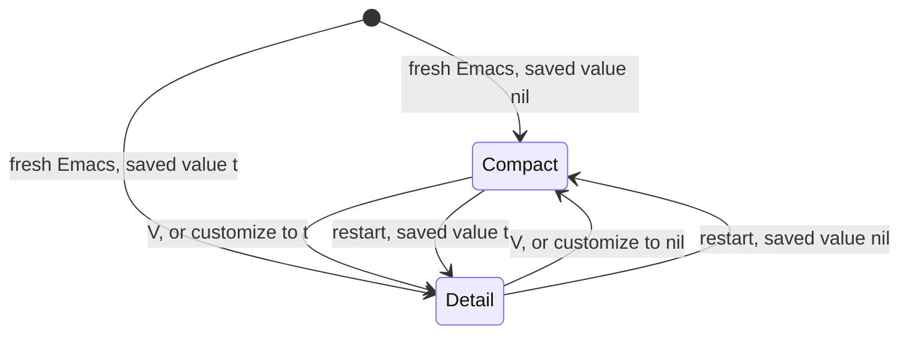
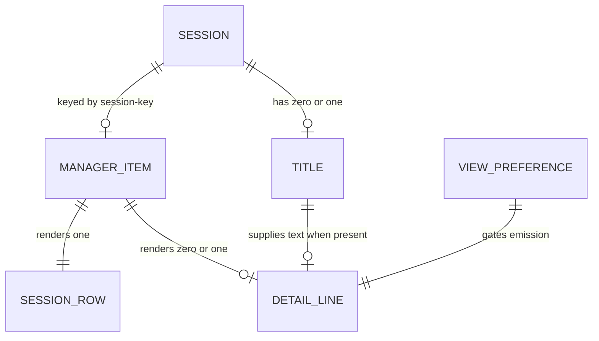

# Data Model: Sidebar Detail View

**Feature**: `006-sidebar-detail-view` | **Date**: 2026-09-08

This feature adds no persistent record and no struct field. It adds one user
option, one face, and one derived value. The model below states where each
entity from [spec.md](spec.md#key-entities) lives in the running program.

## Entities

### Session title

The text the detail line shows.

| Property | Value |
|---|---|
| Storage | `title` slot on the `claude-code-ide-session` struct, `claude-code-ide.el:409-411` |
| Type | string or `nil` |
| Written by | `claude-code-ide--record-ghostel-title`, `claude-code-ide.el:911-923`, an `:after` advice on the Ghostel title setter |
| Source | the terminal OSC 2 title |
| Read by this feature | `claude-code-ide-session-title`, already forward-declared at `claude-code-ide-manager.el:34` |
| Lifetime | in memory, for the life of the Session. Not written to disk by this feature |
| Absent when | Ghostel has not reported a title |

**Not changed by this feature.** The feature is a reader.

### Displayable title (derived)

The normalized value the detail line and the pin-order editor both display.

| Property | Value |
|---|---|
| Produced by | new helper `claude-code-ide-manager--item-title (item)` |
| Input | a `claude-code-ide-manager-item` |
| Resolution | `claude-code-ide-manager--session-record` on the item's session key, then `claude-code-ide-session-title` |
| Normalization | flatten newlines with `(replace-regexp-in-string "[\r\n]+" " " title)`, then drop the leading status glyphs matched by `claude-code-ide-manager--title-prefix-regexp`, then trim |
| Returns | a single-line non-empty string, or `nil` |
| Returns `nil` for | no Session record, `nil` title, empty string, whitespace only, glyphs only |
| Also used by | `claude-code-ide-manager--pin-order-item-names`, `claude-code-ide-manager.el:2194-2207`, which performs these steps inline today |

**Validation rules**, from FR-003 and FR-004:

1. A carriage return or newline never reaches the buffer.
2. An empty or whitespace-only title is equivalent to no title.
3. `nil` means "render no detail line". There is no fallback content.

### View preference

| Property | Value |
|---|---|
| Symbol | `claude-code-ide-manager-show-session-titles` |
| Type | boolean |
| Default | `nil`, the compact view |
| Persistence | the customize interface only. Never the manager state file |
| `:set` | sets the default, then redraws every live manager sidebar |
| Changed by `V` | with plain `setq`, so the saved value is untouched and `:set` does not run |
| Read at | render time, inside `claude-code-ide-manager--insert-item` |

**State transitions**:

The restart transitions are the point of clarification 1. A restart always
reads the saved value, so a `V` press never survives one.

### Detail line (rendered)

Not a stored entity. It is a buffer line produced during one render pass.

| Property | Value |
|---|---|
| Emitted by | `claude-code-ide-manager--insert-item`, after the row's property calls at `claude-code-ide-manager.el:2582-2609` |
| Emitted when | the option is on AND the displayable title is non-`nil` |
| Cardinality | zero or one per Session row. Never more |
| Text | `(space :align-to 7)` display spec, then the displayable title, then a newline |
| Face | `claude-code-ide-manager-session-title-face`, applied to its own range only |
| Carries | `claude-code-ide-manager-session-key`, so a click resolves to the Session |
| Does not carry | `claude-code-ide-manager-session-name-start`, so Avy skips it |
| Does not carry | any row status face. See D1 in [research.md](research.md#d1-a-real-buffer-line-inserted-after-the-row-closes) |

### Session row (existing)

| Property | Value |
|---|---|
| Emitted by | `claude-code-ide-manager--insert-item`, `claude-code-ide-manager.el:2551-2609` |
| Label starts at | display column 7. See D4 in [research.md](research.md#d4-column-7-using-the-existing-align-to-idiom) |
| Carries | `claude-code-ide-manager-session-key`, `help-echo`, `mouse-face`, one `session-name-start` position, and an optional status face |
| Changed by this feature | only the `help-echo` string, and only when the option is on, per FR-002 and FR-017 |

## Relationships

A detail line exists only where a Session row, a non-empty title, and the
enabled preference all coincide. Any one missing means one line for that
Session.

## What this feature does not add

Stated so a reviewer can check the diff against it:

- No new slot on `claude-code-ide-session`.
- No new slot on `claude-code-ide-manager-item`. In particular the existing
  `secondary-text` slot (`claude-code-ide-manager.el:315`) is not reused. It
  holds an abbreviated remote directory for the tooltip and has different
  meaning and lifetime.
- No new key in `claude-code-ide-manager--serialize-state`
  (`claude-code-ide-manager.el:1454-1460`), whose keys stay `:version`,
  `:scopes`, and `:layouts`.
- No new scope-state plist key. The view is not per scope.
- No new hook, timer, or process.
