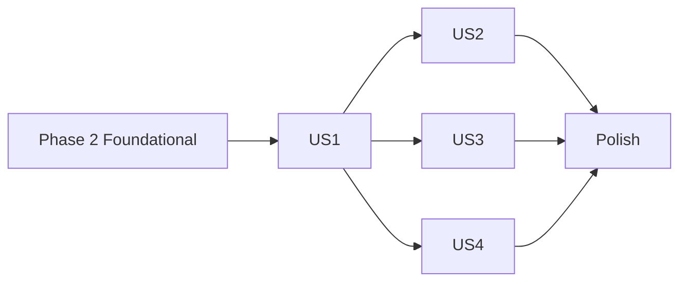

---

description: "Task list for the focused sidebar view"
---

# Tasks: Focused Sidebar View

**Input**: Design documents from `specs/017-focused-sidebar-view/`

**Prerequisites**: [plan.md](plan.md), [spec.md](spec.md), [research.md](research.md), [data-model.md](data-model.md), [contracts/elisp-surface.md](contracts/elisp-surface.md), [quickstart.md](quickstart.md)

**Tests**: Required. Constitution principle II says that new logic ships with
ERT tests in `claude-code-ide-tests.el`. Each test proves a property from
[contracts/elisp-surface.md](contracts/elisp-surface.md#behavioral-invariants).
A test that copies the implementation is not allowed. Generated inputs use a
fixed seed, and `ert-info` prints that seed.

**Organization**: Tasks are grouped by user story. Most code goes into one
file, `claude-code-ide-manager.el`, so tasks in that file run in order.

## Format: `[ID] [P?] [Story] Description`

- **[P]**: Can run in parallel (a different file, no dependency on an
  incomplete task)
- **[Story]**: US1 to US4 from [spec.md](spec.md)

## Path Conventions

This is a single Emacs package with flat `*.el` files at the repository root.
Line numbers are from planning time. Find each anchor by its symbol name, not
by the number.

---

## Phase 1: Setup

**Purpose**: Get a green baseline, so that a later failure belongs to this
feature.

- [X] T001 Run `./scripts/compile-and-test.sh` from the repository root and record the result. Expected: 0 unexpected. If it fails, stop and report the failure, because this feature must not hide a failure that existed before it.

---

## Phase 2: Foundational (Blocking Prerequisites)

**Purpose**: Add the setting, the membership rule, and the shared list that every story reads.

**⚠️ CRITICAL**: No user story work can start until this phase is complete.

- [X] T002 Rename `claude-code-ide-manager--set-show-session-titles` to `claude-code-ide-manager--set-and-refresh` in `claude-code-ide-manager.el` (defun near line 271, `:set` use near line 285). Keep the body: `set-default`, then `claude-code-ide-manager--refresh-sidebar-state`. Leave no alias. A grep must find no other user. Specs 006 mention the old name in their history, and they stay unchanged.
- [X] T003 Add `(defcustom claude-code-ide-manager-focused-view nil ...)` in `claude-code-ide-manager.el`, right after `claude-code-ide-manager-show-session-titles`. Use `:type 'boolean`, `:initialize #'custom-initialize-default`, `:set #'claude-code-ide-manager--set-and-refresh`, and `:group 'claude-code-ide-manager`. The docstring says three things. The option selects the view at startup. The `f` command (`claude-code-ide-manager-toggle-focused-view`) changes only the running Emacs. The manager state file never stores the view. The `custom-initialize-default` is required, see [contracts/elisp-surface.md](contracts/elisp-surface.md#added-user-option).
- [X] T004 Add `(defvar claude-code-ide-manager--focus-kept-session-key nil ...)` and `claude-code-ide-manager--focus-member-p (session-key)` in `claude-code-ide-manager.el`, right after `claude-code-ide-manager--session-priority` (near line 2180). The predicate returns non-nil when `(< (claude-code-ide-manager--session-priority session-key) 5)`. It also returns non-nil when SESSION-KEY equals both the kept key and `claude-code-ide-manager--current-session-key`. Do not list the states again. The rank is the single source, see research R2.
- [X] T005 Add `claude-code-ide-manager--displayed-items (scope &optional view)` in `claude-code-ide-manager.el`, right after `claude-code-ide-manager--sorted-items` (near line 2129). It returns `(claude-code-ide-manager--sorted-items (claude-code-ide-manager--scope-items scope) nil scope view)`. When `claude-code-ide-manager-focused-view` is non-nil, it keeps only items whose session key satisfies `claude-code-ide-manager--focus-member-p`. With the option nil, it must return the same list that `--sorted-items` returns.

**Checkpoint**: The package byte-compiles. No caller uses the new function yet, so nothing that the user sees has changed.

---

## Phase 3: User Story 1 - See only the Sessions that need me (Priority: P1) 🎯 MVP

**Goal**: `f` hides every Session without a monitored status, shows that the focused view is on, and states when no Session needs attention.

**Independent Test**: Use Sessions in mixed states. Press `f` and compare the rows with the Sessions whose rank is below 5. Press `f` again and compare with the full-view render.

### Tests for User Story 1

> Write these tests first. Make sure they fail before T007.

- [X] T006 [P] [US1] Add ERT tests to `claude-code-ide-tests.el` next to `claude-code-ide-test-manager-priority-*`. Name each test `claude-code-ide-test-manager-focused-view-*`. Use `claude-code-ide-tests--with-priority-sessions` and let-bind `claude-code-ide-manager-focused-view`. Prove these properties:
  1. **Filter equals membership**: Generate status mixes with a fixed seed over `needs-input`, `failed`, `done`, `working`, `idle`, `nil` with output-idle, and `nil` with no flags. For each mix, the rendered row keys are exactly the members. Read the row keys in buffer order from the `claude-code-ide-manager-session-name-start` positions. The keys must also form a subsequence of the full-view row keys. Print the seed and the mix with `ert-info`.
  2. **Off shows everything**: With the option nil and the same generated mixes, the rendered row keys equal the keys of `claude-code-ide-manager--sorted-items` for the scope, so every Session has a row whatever its status. No line starts with `Focused:`. The existing render tests, which stay unchanged and green, cover byte-identical output.
  3. **Indicator and empty state**: With the option on, the first line reads `Focused: N of M` and carries no `claude-code-ide-manager-session-key`. With no member, the buffer holds only `Focused: no Session needs attention`.
  4. **Toggle has no side effects**: `claude-code-ide-manager-toggle-focused-view` leaves every Session's `claude-code-ide-session-agent-state`, `claude-code-ide-session-idle-p`, and `claude-code-ide-session-acknowledged-agent-state` unchanged. It leaves the saved customize value (`(get 'claude-code-ide-manager-focused-view 'saved-value)`) unchanged. `claude-code-ide-manager--serialize-state` keeps only the keys `:version`, `:scopes`, and `:layouts`. The current Session stays the same.
  5. **Customize redraws**: `customize-set-variable` on the option re-renders an open sidebar with no explicit refresh call.

### Implementation for User Story 1

- [X] T007 [US1] In `claude-code-ide-manager--render` in `claude-code-ide-manager.el` (near line 3104), replace the `--sorted-items` call with `(claude-code-ide-manager--displayed-items scope)`. The existing `--slot-map items t` then numbers the displayed rows from 1. The `previous-group`/`previous-host` loop then writes headings only for displayed rows. When `claude-code-ide-manager-focused-view` is non-nil, insert one first line after `erase-buffer`. It reads `Focused: N of M` (N = displayed, M = all scope items), or `Focused: no Session needs attention` when N is 0. Use the `shadow` face and no Session key property. Leave the option-nil path byte-identical.
- [X] T008 [US1] Add the interactive command `claude-code-ide-manager-toggle-focused-view` in `claude-code-ide-manager.el`, right after `claude-code-ide-manager-toggle-session-titles` (near line 3102). It runs `setq` on the option, never `customize-set-variable`. It then calls `claude-code-ide-manager--refresh-sidebar-state` and reports `Manager focused view: on (N of M Sessions)` or `Manager focused view: off`. Compute N and M from `--displayed-items` and `--scope-items` of `(claude-code-ide-manager--scope-for-command)`. Do not call `--save-state` or `--reset-session-idle-state`. Bind it with `(define-key claude-code-ide-manager-mode-map (kbd "f") #'claude-code-ide-manager-toggle-focused-view)` next to the `V` binding (near line 1411).
- [X] T009 [P] [US1] In `claude-code-ide-transient.el`, add `(declare-function claude-code-ide-manager-toggle-focused-view "claude-code-ide-manager" ())` next to the `toggle-session-titles` declaration (near line 96). Add `(defvar claude-code-ide-manager-focused-view)` next to `(defvar claude-code-ide-manager-show-session-titles)` (near line 145). Add an "Arrange" entry right after `V` in `claude-code-ide-manager-dispatch` (near line 750): `("f" claude-code-ide-manager-toggle-focused-view :description (lambda () (format "Focused view (%s)" (if claude-code-ide-manager-focused-view "on" "off"))))`.

**Checkpoint**: `f` filters the rows and shows low numbers. Number keys and `n`/`p` still index the full list until US2 is complete.

---

## Phase 4: User Story 2 - Jump with low numbers (Priority: P1)

**Goal**: Number keys, row navigation, group navigation, priority passes, and row moves act on the rows that the user sees.

**Independent Test**: Render the reference set. Press `1`, `2`, and `3`, and check that each key switches to the row that shows the same number.

### Tests for User Story 2

- [X] T010 [P] [US2] Add ERT tests to `claude-code-ide-tests.el`, named `claude-code-ide-test-manager-focused-view-*`. Prove these properties:
  1. **Rows, numbers, and keys agree**: Use the T006 fixed-seed status generator, with up to 12 Sessions, in the flat and the grouped arrangement. For grouped, set `(puthash "global" '(:view grouped) claude-code-ide-manager--scope-state)` and group metadata as in `claude-code-ide-test-manager-grouped-navigation-selection-and-focus`. Check three things. The rendered row keys equal `claude-code-ide-manager--visible-session-keys`. The Nth row text shows `N.` for N ≤ 10, and the later rows show `-`. `claude-code-ide-manager-switch-by-slot` with N sets `claude-code-ide-manager--current-session-key` to the Nth row's key.
  2. **Out-of-range number**: `switch-by-slot` with a number above the row count leaves the current Session unchanged.
  3. **Row moves stay visible**: With the focused view on, a hidden Session between two visible ones, and `claude-code-ide-manager-move-down` on the first visible row, the two visible rows trade places in the render.

### Implementation for User Story 2

- [X] T011 [US2] In `claude-code-ide-manager.el`, route each of these through `claude-code-ide-manager--displayed-items`, with the same SCOPE and VIEW arguments the current `--sorted-items` call uses:
  - `claude-code-ide-manager--visible-session-keys` (near line 2538). This covers `n`/`p`/`j`/`k` and the `]`/`[` passes through `--live-visible-session-keys`.
  - `claude-code-ide-manager--displayed-groups` (near line 3498, view `'grouped`). This covers `C-j`/`C-k` and `M-P`/`M-N`.
  - `claude-code-ide-manager--neighbor-in-bucket` (near line 3478).
  - `claude-code-ide-manager-switch-by-slot-preserve-focus` and `claude-code-ide-manager-switch-by-slot` (near lines 5476 and 5488). Keep their `(min 10 ...)` cap. Compute the cap on the displayed list length, not on the length of `--scope-items`.

  Do not change `--materialize-order-keys`, `--swap-order`, `claude-code-ide-manager-edit-pin-order`, or the pin-order editor (FR-019).

**Checkpoint**: In the focused view, every number key, navigation key, and move key matches what the sidebar shows.

---

## Phase 5: User Story 3 - Handled Sessions leave on their own (Priority: P1)

**Goal**: A Session the user switches to stays while it is active, if it needed attention when the user arrived. It leaves after the user switches away, unless it still has a monitored status.

**Independent Test**: Mark one Session output-idle. With the focused view on, switch to it, and then to a second Session. Check the rows after each step.

### Tests for User Story 3

- [X] T012 [P] [US3] Add ERT tests to `claude-code-ide-tests.el`, named `claude-code-ide-test-manager-focused-view-*`. Use real switches through `claude-code-ide-manager-switch-to-session` in `claude-code-ide-tests--with-priority-sessions`. Prove these properties:
  1. **Handled Session leaves after the user leaves**: Run three cases, output-idle (`nil` state, idle enabled, idle-p t), `done`, and `failed`. In each case, the target is a visible row after a switch to it, even though the switch acknowledged it. Its number is unchanged. After a switch to another Session, it is gone.
  2. **Unacknowledged states stay**: `needs-input` and `working` targets stay visible after a switch to them and after a switch away.
  3. **Active alone earns nothing**: A switch to a Session with rank 5 leaves it hidden. The sidebar has no row with the current-session face.
  4. **Earned while watching**: Switch to a quiet Session. Set its state to `working` and render. Then set it to `idle`, as a watched finish does. It stays visible. After a switch away, it is gone.
  5. **Clear-all**: `claude-code-ide-manager-clear-all-idle-state` removes every acknowledged non-active Session. It keeps the active Session that was visible.
  6. **Return is a new activation**: Switch A (earned) → B → A, where A is now quiet. A is hidden after the return.
  7. **Repeat switch keeps the row**: A second switch to the already current earned Session keeps it visible.
  8. **Window-change activation survives the visibility clear (regression for research R4)**: Let-bind `window-configuration-change-hook` to nil. Reproduce the real load order: call `claude-code-ide-manager--install-window-config-refresh-hook` first. Then run `(add-hook 'window-configuration-change-hook #'claude-code-ide-session-idle--handle-visibility-change)` at the default depth, as session-idle.el:694-697 does. Open the global sidebar, with A current and B output-idle (`nil` state, idle enabled, idle-p t). Run a second case where B is `done`. Show B in the content window with `set-window-buffer`, without any manager command. Stub `frame-focus-state` to return t, then call `(run-window-configuration-change-hook)`. Assert four things. `claude-code-ide-manager--current-session-key` is B. B's `claude-code-ide-session-idle-p` is nil, or its state is `idle`, which proves that the visibility clear ran. B is a rendered row. After a switch to A, B is gone. Then repeat the case with `claude-code-ide-manager--note-focus-on-window-change` removed from the hook, and assert that B is not a row. This proves that the test detects the race.

### Implementation for User Story 3

- [X] T013 [US3] Add `claude-code-ide-manager--note-focus-activation (session-key)` in `claude-code-ide-manager.el`, right after `claude-code-ide-manager--focus-member-p`. When SESSION-KEY differs from `claude-code-ide-manager--current-session-key`, it sets `claude-code-ide-manager--focus-kept-session-key` to SESSION-KEY if `(< (claude-code-ide-manager--session-priority session-key) 5)`, and to nil otherwise. When the keys are equal, it does nothing. See [data-model.md](data-model.md#state-transitions-of-kept).
- [X] T014 [US3] Call `(claude-code-ide-manager--note-focus-activation session-key)` in `claude-code-ide-manager-switch-to-session` and `claude-code-ide-manager-reset-layout`, right after `--ensure-live-target` succeeds. It must run before any layout restore or build sets `--current-session-key`, and before `--reset-session-idle-state`. This order is the whole point, see research R3. A failed switch must not record a pending activation (research R4, implementation finding).
- [X] T015 [US3] Make window-change activation capture before the idle visibility clear (research R4), in `claude-code-ide-manager.el`:
  1. Factor `(and manager-visible-p (claude-code-ide-manager--visible-layout-session-key))` out of `claude-code-ide-manager--refresh-on-window-configuration-change` (near line 2270) into `claude-code-ide-manager--window-change-session-key`, placed right before that function. The refresh hook binds `layout-session-key` from the helper, and its behavior stays the same.
  2. Add `claude-code-ide-manager--note-focus-on-window-change`. Unless `claude-code-ide-manager--in-window-config-refresh` is non-nil, it calls `(claude-code-ide-manager--note-focus-activation key)` when the helper returns a key.
  3. In `claude-code-ide-manager--install-window-config-refresh-hook` (near line 2447), add it with `(add-hook 'window-configuration-change-hook #'claude-code-ide-manager--note-focus-on-window-change -90)`, guarded by `memq` like the existing entry. The docstring says why the depth is negative: the idle module prepends its visibility handler at depth 0 after the manager loads, and that handler acknowledges the Session.
  4. Do NOT call `--note-focus-activation` inside the refresh hook. At that point the target already has rank 5 and still differs from current, so the call would reset `kept` to nil.
  5. Confirm the live order with `~/bin/emacsclient --eval` after loading the file. The capture must come before `claude-code-ide-session-idle--handle-visibility-change` in `(default-value 'window-configuration-change-hook)`.
- [X] T016 [US3] In `claude-code-ide-manager--displayed-items` in `claude-code-ide-manager.el`, before it filters, set `claude-code-ide-manager--focus-kept-session-key` (and `--focus-activation-key`) to `claude-code-ide-manager--current-session-key` when that key is non-nil, its rank is below 5, and `--focus-activation-key` is nil or equals it. Do this whether the option is on or off, so that turning the view on in the middle of an activation keeps the earned row. The activation-key guard keeps a render inside the window-change hook from overwriting a pending capture (research R4).

**Checkpoint**: The full lifecycle from the user's description works. A handled Session leaves only after the user leaves it.

---

## Phase 6: User Story 4 - Keep host and project context (Priority: P2)

**Goal**: Visible remote Sessions keep their `[host]` and project headings in the grouped arrangement and their labels in the flat arrangement.

**Independent Test**: Render remote and local Sessions in the focused view in both arrangements, and check the headings and labels.

### Tests for User Story 4

- [X] T017 [P] [US4] Add ERT tests to `claude-code-ide-tests.el`, named `claude-code-ide-test-manager-focused-view-*`. Build remote items with `:host` as in `claude-code-ide-test-manager-grouped-navigation-selection-and-focus`. Give one host two groups, and leave one of those groups with no member. Prove these properties:
  1. **Headings follow rows**: In the grouped arrangement, every `[host]` heading and every project heading is followed by at least one row of that host or group before the next heading of the same kind. The host of a visible remote row appears as a `[host]` heading above it.
  2. **Flat labels kept**: In the flat arrangement, each visible row's label text equals its label in the full view.
  3. **Arrangement switch keeps the filter**: After `claude-code-ide-manager-toggle-grouped-view`, the set of displayed keys is unchanged.

### Implementation for User Story 4

- [X] T018 [US4] Run the T017 tests. Research R7 predicts no code change, because T007 already feeds the filtered list to the heading loop in `claude-code-ide-manager--render` in `claude-code-ide-manager.el`. If a test fails, fix `--render` so that it writes a heading only before a displayed row. Do not weaken the test.

**Checkpoint**: All four stories pass their own tests.

---

## Phase 7: Polish & Cross-Cutting Concerns

- [X] T019 [P] Update `README.org`. Add `- =f= toggles the focused view: only Sessions that need attention, numbered from 1` to the sidebar key list after the `=v=` line (near line 707), and the same item to the `?` menu list (near line 545). Add a short paragraph after the flat/grouped paragraph (near line 575). It names `claude-code-ide-manager-focused-view` as the startup setting and says that `f` changes the running Emacs only. It says that a handled Session leaves after the user switches away.
- [X] T020 [P] Add a `### Focused view` term to `CONTEXT.md`, after `### Detail view`. Define it as a manager sidebar view that shows only Sessions with a monitored status, plus the active Session that earned its row during its current activation, numbered from 1. Say that `f` switches it and that `claude-code-ide-manager-focused-view` selects it at startup.
- [X] T021 Run `./scripts/format-and-clean.sh`. Treat unexpected indentation changes in `claude-code-ide-manager.el`, `claude-code-ide-transient.el`, or `claude-code-ide-tests.el` as unbalanced parentheses, and fix them.
- [X] T022 Run `./scripts/compile-and-test.sh`. Expected: no new byte-compile warning, and 0 unexpected results.
- [X] T023 Do a live check with `emacsclient`, following [quickstart.md](quickstart.md) sections 3 to 9. Load `claude-code-ide-manager.el` and `claude-code-ide-transient.el` with `~/bin/emacsclient --eval '(load-file ...)'` (do not use the computer-use tool). Toggle `f` in the real sidebar. Check the reference-screenshot shape and the lifecycle with real Sessions. Report what you saw.

---

## Dependencies & Execution Order

### Phase Dependencies

- **Setup (Phase 1)**: none.
- **Foundational (Phase 2)**: after T001. T002 → T003, and T004 → T005, in order, because they share one file.
- **US1 (Phase 3)**: after Phase 2.
- **US2 (Phase 4)**: after Phase 2. Its tests also need T007 (render) and T008 (option toggle) to observe rows, so run it after US1.
- **US3 (Phase 5)**: after US1. Its tests read rendered rows.
- **US4 (Phase 6)**: after US1. Independent of US2 and US3.
- **Polish (Phase 7)**: after every story.

### User Story Dependencies



### Within Each User Story

- Write the test task first and make sure it fails.
- Tasks in `claude-code-ide-manager.el` run in ID order, because they edit one file.

### Parallel Opportunities

- T006, T010, T012, and T017 edit `claude-code-ide-tests.el`. Each can run beside the implementation tasks of its own story in `claude-code-ide-manager.el`. They must not run together, because they edit the same file.
- T009 (`claude-code-ide-transient.el`) can run beside T007 and T008.
- T019 (`README.org`) and T020 (`CONTEXT.md`) can run together, and beside any story phase.
- After US1, the implementation of US3 (T013 to T016) and the test of US4 (T017) can run together.

---

## Parallel Example: User Story 1

```bash
# Different files, no shared dependency:
Task: "T006 focused-view filter/indicator/toggle tests in claude-code-ide-tests.el"
Task: "T009 dispatch entry, declare-function, defvar in claude-code-ide-transient.el"
# Then, in order, in claude-code-ide-manager.el:
Task: "T007 render through --displayed-items plus the Focused line"
Task: "T008 toggle command and f binding"
```

## Parallel Example: User Story 3 with User Story 4

```bash
Task: "T013-T016 activation capture in claude-code-ide-manager.el"
Task: "T017 heading and label tests in claude-code-ide-tests.el"
```

---

## Implementation Strategy

### MVP First (User Story 1)

1. Phase 1, then Phase 2.
2. Phase 3 (US1): `f` filters, shows the Focused line, and has a startup setting.
3. **Stop and validate** with the T006 tests and a quick `f` press in the live sidebar.

US1 alone already gives the short list. US2 makes the number keys match the
list. Ship US1 and US2 together, because the low numbers are the reason the
user asked for the feature.

### Incremental Delivery

1. Foundation, then US1: the filter is visible.
2. Add US2: the keys match the numbers. This delivers the user's "1, 2, 3" goal.
3. Add US3: handled Sessions leave on their own.
4. Add US4: lock the remote context with tests.
5. Polish: docs, formatter, gate, live check.

---

## Notes

- Do not commit unless the user asks. Leave `TODOs.org` unstaged.
- Do not change switch acknowledgment (ADR 0002). The new code only reads status before it.
- Delete no test that already exists. If an existing test breaks, the cause is a behavior change with the option nil, and that is a bug in this feature.

---

## Phase 8: Convergence

- [X] T024 Make `./scripts/compile-and-test.sh` finish with 0 unexpected results per SC-006 (partial). The 2 unexpected results come from `claude-code-ide-test-remote-worktree-bootstrap-requires-owned-execution` and `claude-code-ide-test-remote-worktree-release-preserves-live-wrapper` in `claude-code-ide-tests.el`. These tests fail intermittently: the real runner subprocess exits with status 1 at `(should (zerop status))`. They fail the same way on a clean `HEAD` worktree without this feature. Find the root cause in the runner fixture or in `claude-code-ide-remote-worktree`, fix it, then run the gate again.
- [X] T025 Do the live lifecycle check per quickstart.md section 6 and T023 (partial). Use real Sessions and `~/bin/emacsclient`. Open an output-idle or `done` Session with `C-x b` in the content window. Confirm that it stays as the active focused row. Then switch away with a manager key, and confirm that its row leaves. Then turn the view off again.
